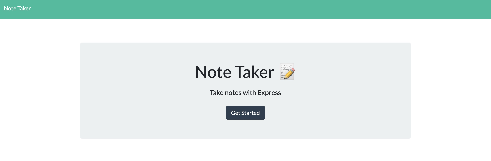
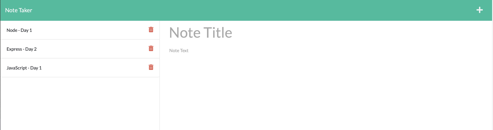

# Note_Taker

## Description

This application allows a user to take notes they can reference later. When the user first visits the site they will be promted to start taking notes. Once on the following screen, the user will add a title for the notes then they can start adding content. Once the user saves the note, it will appear to the left so the user may reference the note later.

### Live Link

https://fast-shelf-21917.herokuapp.com/

## Table of Contents

- [Getting Started](#getting-started)
- [Visual Example](#visual-example)
- [Tech Used](#tech-used)
- [Licenese](#license)

## Getting Started

### Prerequisites

- npm
  ```sh
  npm install npm@latest -g
  ```

### Installation

1. Clone the repo
   ```sh
   git clone https://github.com/irv0735/Ouroboros.git
   ```
2. Install NPM packages
   ```sh
   npm install
   ```
   <p align="right">(<a href="#top">back to top</a>)</p>

## Visual Exampes





  <p align="right">(<a href="#top">back to top</a>)</p>

## Tech Used

  <div style='margin: 1em 0;'>


</div>

<p align="right">(<a href="#top">back to top</a>)</p>

## License

MIT

<p align="right">(<a href="#top">back to top</a>)</p>
